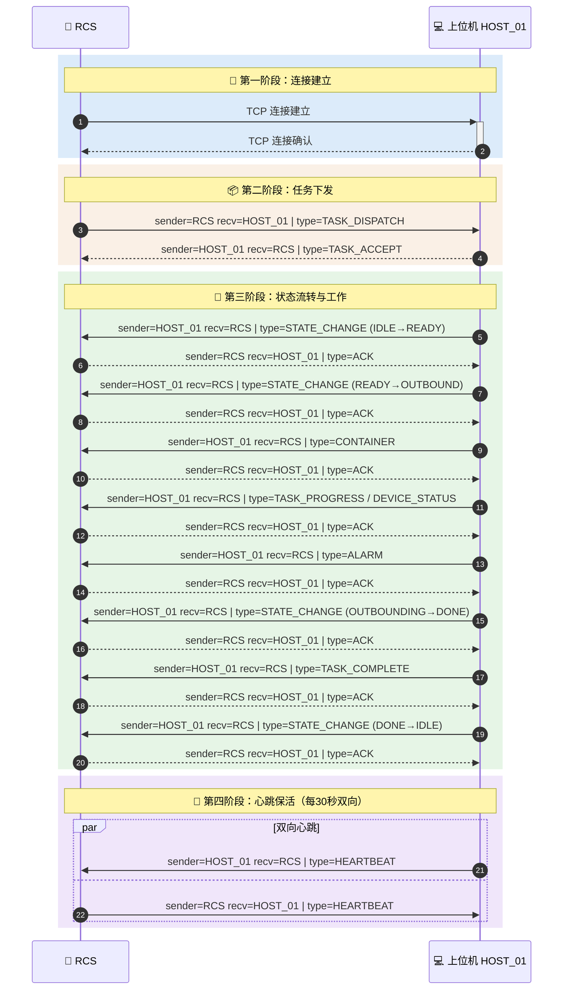

# 出库工作站上位机-RCS 通信协议 V0.1

## 一、报文格式：换行分隔 JSON

```
| body(JSON) | \n |
```

- 每条报文 = 一行紧凑 JSON + `\n` 换行符
- 接收端按行读取即可切分包边界

---

## 二、JSON 统一格式

所有报文最外层固定五个字段 `type` + `sender` + `receiver` + `timestamp` + `data`：

```json
{
  "type": "TASK_DISPATCH | ACK | TASK_ACCEPT | TASK_COMPLETE | STATE_CHANGE | TASK_PROGRESS | ALARM | CONTAINER | OUTBOUND_RESULT | DEVICE_STATUS | HEARTBEAT",
  "sender": "RCS | HOST_01 | HOST_02 | ...",
  "receiver": "RCS | HOST_01 | HOST_02 | ...",
  "timestamp": "2026-04-28 10:00:00",
  "data": { ... }
}
```

| 字段        | 类型     | 必填 | 说明                        |
| --------- | ------ | -- | ------------------------- |
| type      | string | 是  | 业务类型                      |
| sender    | string | 是  | 发送端标识，`"RCS"` 或 `"HOST_01"` ~ `"HOST_NN"` |
| receiver  | string | 是  | 接收端标识，`"RCS"` 或 `"HOST_01"` ~ `"HOST_NN"` |
| timestamp | string | 是  | 时间戳 `YYYY-MM-DD HH:MM:SS`  |
| data      | object | 是  | 各类型业务数据，字段见下方            |

**地址标识规则：**

| 标识        | 含义     | 示例          |
| --------- | ------ | ----------- |
| `"RCS"`   | RCS 调度系统 | 固定值         |
| `"HOST_01"` | 上位机1  | `"HOST_02"`, `"HOST_03"`, ... |

> 方向自然体现：RCS→上位机 sender=`"RCS"`, receiver=`"HOST_01"`；上位机→RCS 反之。

---

## 三、各 type 详细定义

### 3.1 TASK_DISPATCH（任务下发：出库 / 放货）

> sender=`"RCS"`, receiver=`"HOST_01"`~`"HOST_NN"`

```json
{
  "type": "TASK_DISPATCH",
  "sender": "RCS",
  "receiver": "HOST_01",
  "timestamp": "2026-04-28 10:00:00",
  "data": {
    "task_id": "T20260428001",
    "task_types":"OUTBOUND"
    "packages": [
      {
        "package_id": "PKG001",
        "face_sheet": "SF1234567890",
        "logistics": "顺丰标快",
        "manual_process_type": "无",
        "packaging_line": "高速线1",
        "goods": [
          {"goods_id": "SKU-A001", "count": 2},
          {"goods_id": "SKU-A002", "count": 1}
        ]
      }
    ]
  }
}
```

| 字段                                | 类型     | 必填 | 说明                                 |
| --------------------------------- | ------ | -- | ---------------------------------- |
| data.task_id                      | string | 是  | 任务流水号                              |
| data.task_types                      | string | 是  | 任务类型（放货，出库）                              |
| data.packages                     | array  | 是  | 出库包裹数据列表                           |
| data.packages[].package_id        | string | 是  | 包裹ID                               |
| data.packages[].face_sheet        | string | 否  | 面单信息                               |
| data.packages[].logistics         | string | 否  | 物流类型                               |
| data.packages[].manual_process_type | string | 否  | 无 / 赠品 / 软包                      |
| data.packages[].packaging_line    | string | 否  | 高速线1 / 高速线2 / 多盒包装线 / 人工处理线 / 合单缓存线 |
| data.packages[].goods             | array  | 是  | 货物列表                               |
| data.packages[].goods[].goods_id  | string | 是  | 货物SKU编码                            |
| data.packages[].goods[].count     | int    | 是  | 数量                                 |

### 3.2 TASK_ACCEPT（任务接收确认）


```json
{
  "type": "TASK_ACCEPT",
  "sender": "HOST_01",
  "receiver": "RCS",
  "timestamp": "2026-04-28 10:00:01",
  "data": {
    "task_id": "T20260428001",
    "result": 0,
    "message": "OK"
  }
}
```

| 字段             | 类型     | 必填 | 说明              |
| -------------- | ------ | -- | --------------- |
| data.task_id   | string | 是  | 任务ID            |
| data.result    | int    | 是  | 见 result 编码表   |
| data.message   | string | 否  | 附加描述            |

### 3.3 TASK_COMPLETE（任务完成通知）


```json
{
  "type": "TASK_COMPLETE",
  "sender": "HOST_01",
  "receiver": "RCS",
  "timestamp": "2026-04-28 10:35:00",
  "data": {
    "task_id": "T20260428001",
    "task_types": "OUTBOUND"
    "status": "COMPLETED",
    "completed_goods": 12,
    "total_goods": 12,
    "completed_packages": ["PKG001", "PKG002"],
    "finish_time": "2026-04-28 10:35:00"
  }
}
```

| 字段                       | 类型     | 必填 | 说明         |
| ------------------------ | ------ | -- | ---------- |
| data.task_id             | string | 是  | 任务ID       |
| data.task_types          | string | 是  | 任务类型（放货，出库）|
| data.status              | string | 是  | COMPLETED / FAILED |
| data.completed_goods     | int    | 是  | 已完成货物数量    |
| data.total_goods         | int    | 是  | 总货物数量      |
| data.completed_packages  | array  | 是  | 已完成的包裹ID列表 |
| data.finish_time         | string | 是  | 完成时间戳      |

### 3.4 STATE_CHANGE（工作站状态变更）


```json
{
  "type": "STATE_CHANGE",
  "sender": "HOST_01",
  "receiver": "RCS",
  "timestamp": "2026-04-28 10:00:05",
  "data": {
    "station_id": 1,
    "task_id": "T20260428001",
    "previous_state": "IDLE",
    "current_state": "READY",
    "trigger": "TASK_ASSIGNED"
  }
}
```

| 字段                    | 类型     | 必填 | 说明                              |
| --------------------- | ------ | -- | ------------------------------- |
| data.station_id       | int    | 是  | 工作站编号                            |
| data.task_id          | string | 否  | 关联任务ID                           |
| data.previous_state   | string | 是  | 变更前状态（IDLE / READY / OUTBOUND/ DONE/ DELIVERED/ WAITING_DELIVERY/ ERROR） |
| data.current_state    | string | 是  | 变更后状态                            |
| data.trigger          | string | 是  | TASK_ASSIGNED / ACTION_START / ALL_ACTIONS_DONE / RESET / ALARM |

### 3.5 TASK_PROGRESS（任务进度上报）


```json
{
  "type": "TASK_PROGRESS",
  "sender": "HOST_01",
  "receiver": "RCS",
  "timestamp": "2026-04-28 10:05:00",
  "data": {
    "task_id": "T20260428001",
    "status": "EXECUTING",
    "completed_goods": 5,
    "total_goods": 12,
    "completed_packages": ["PKG001"]
  }
}
```

| 字段                    | 类型   | 必填 | 说明                          |
| ----------------------- | ------ | ---- | ----------------------------- |
| data.task_id            | string | 是   | 任务ID                        |
| data.status             | string | 是   | RECEIVED / EXECUTING / PAUSED |
| data.completed_goods    | int    | 是   | 已完成货物数量                |
| data.total_goods        | int    | 是   | 总货物数量                    |
| data.completed_packages | array  | 是   | 已完成的包裹ID列表            |

### 3.6 ALARM（告警与异常上报）


```json
{
  "type": "ALARM",
  "sender": "HOST_01",
  "receiver": "RCS",
  "timestamp": "2026-04-28 10:10:00",
  "data": {
    "alarm_id": "ALM20260428001",
    "level": "ERROR",
    "device": "工作站1-夹爪1",
    "alarm_type": "GRIPPER_FAILURE",
    "task_id": "T20260428001",
    "station_id": 1
  }
}
```

| 字段            | 类型   | 必填 | 说明                                  |
| --------------- | ------ | ---- | ------------------------------------- |
| data.alarm_id   | string | 是   | 告警ID                                |
| data.level      | string | 是   | INFO / WARNING / ERROR / CRITICAL     |
| data.device     | string | 是   | `工作站1-夹爪1` / `输送线` / `扫码器` |
| data.alarm_type | string | 是   | 见告警类型编码表                      |
| data.task_id    | string | 否   | 关联任务ID                            |
| data.station_id | int    | 否   | 关联工作站编号                        |

### 3.7 CONTAINER（收纳柜货位数据上报）


```json
{
  "type": "CONTAINER",
  "sender": "HOST_01",
  "receiver": "RCS",
  "timestamp": "2026-04-28 10:05:00",
  "data": {
    "station_id": 1,
    "containers": [
      {"location_id": "A-01-03", "status": "OCCUPIED", "goods_id": "SKU-A001", "count": 5},
      {"location_id": "A-01-04", "status": "EMPTY",     "goods_id": "", "count": 0}
    ],
    "total_slots": 24,
    "occupied_slots": 10,
    "empty_slots": 14
  }
}
```

| 字段                              | 类型     | 必填 | 说明                                |
| ------------------------------- | ------ | -- | --------------------------------- |
| data.station_id                 | int    | 是  | 工作站编号                             |
| data.containers                 | array  | 是  | 货位列表                              |
| data.containers[].location_id   | string | 是  | 货位ID，如 `A-01-03`                  |
| data.containers[].status        | string | 是  | EMPTY / OCCUPIED                  |
| data.containers[].goods_id      | string | 是  | 货物SKU编码，空位时为空                     |
| data.containers[].count         | int    | 是  | 货物数量，空位时为 0                       |
| data.total_slots                | int    | 否  | 货位总数                     |
| data.occupied_slots             | int    | 否  | 已占用数                     |
| data.empty_slots                | int    | 否  | 空位数                      |

### 3.8 DEVICE_STATUS（设备状态周期上报）


```json
{
  "type": "DEVICE_STATUS",
  "sender": "HOST_01",
  "receiver": "RCS",
  "timestamp": "2026-04-28 10:05:00",
  "data": {
    "task_id": "T20260428001",
    "stations": [
      {
        "station_id": 1,
        "grippers": [
          {"gripper_id": 1, "status": "GRASPING"},
          {"gripper_id": 2, "status": "IDLE"}
        ],
        "conveyor": "RUNNING",
        "scanner_online": true
      }
    ]
  }
}
```

| 字段                                         | 类型     | 必填 | 说明                                     |
| ------------------------------------------ | ------ | -- | -------------------------------------- |
| data.task_id                               | string | 否  | 关联任务ID                                 |
| data.stations                              | array  | 是  | 各工作站状态                                  |
| data.stations[].station_id                 | int    | 是  | 工作站编号                                  |
| data.stations[].grippers                   | array  | 是  | 夹爪状态                                    |
| data.stations[].grippers[].gripper_id      | int    | 是  | 夹爪编号                                   |
| data.stations[].grippers[].status          | string | 是  | IDLE / GRASPING / MOVING / PLACING / FAULT |
| data.stations[].conveyor                   | string | 是  | RUNNING / STOPPED / JAMMED                |
| data.stations[].scanner_online             | bool   | 是  | 扫码器是否在线                                 |

### 3.9 ACK（通用确认）

> 确认对方消息已收到，`result=0` 表示接收成功。

```json
{
  "type": "ACK",
  "sender": "HOST_01",
  "receiver": "RCS",
  "timestamp": "2026-04-28 10:00:01",
  "data": {
    "result": 0,
    "message": "OK"
  }
}
```

| 字段          | 类型     | 必填 | 说明                                       |
| ----------- | ------ | -- | ---------------------------------------- |
| data.result | int    | 是  | 0=成功, 1=参数错误, 2=系统繁忙, 3=任务不存在, 4=工作站不可用, 99=未知错误 |
| data.message | string | 否  | 附加描述                                     |

### 3.10 HEARTBEAT（心跳）


```json
{
  "type": "HEARTBEAT",
  "sender": "HOST_01",
  "receiver": "RCS",
  "timestamp": "2026-04-28 10:30:00",
  "data": {}
}
```

- 每 30 秒发送一次，对方 10 秒内回复
- 连续 3 次未收到回复视为断连，触发重连

---

## 四、type 编码汇总

| type              | sender   | receiver | 说明           |
| ----------------- | -------- | -------- | ------------ |
| TASK_DISPATCH     | RCS      | HOST     | 出库任务下发       |
| TASK_ACCEPT       | HOST     | RCS      | 任务接收确认       |
| TASK_COMPLETE     | HOST     | RCS      | 任务完成通知       |
| STATE_CHANGE      | HOST     | RCS      | 工作站状态变更      |
| TASK_PROGRESS     | HOST     | RCS      | 任务进度上报       |
| ALARM             | HOST     | RCS      | 告警与异常上报      |
| CONTAINER         | HOST     | RCS      | 收纳柜货位数据上报    |
| OUTBOUND_RESULT   | HOST     | RCS      | 单次出库动作结果     |
| DEVICE_STATUS     | HOST     | RCS      | 设备状态周期上报     |
| ACK               | 双向       | 双向       | 通用确认         |
| HEARTBEAT         | 双向       | 双向       | 心跳           |

---

## 五、交互时序




---

## 六、编码定义表

### 6.1 任务状态

| 状态值    | 含义   |
| --------- | ------ |
| RECEIVED  | 已接收 |
| EXECUTING | 执行中 |
| PAUSED    | 已暂停 |
| COMPLETED | 已完成 |
| FAILED    | 失败   |

### 6.2 工作站状态机

| 状态值               | 含义   |
| ----------------- | ---- |
| IDLE              | 空闲，等待任务 |
| READY             | 就绪，根据任务类型准备执行  |
| OUTBOUND       | 出库中，夹爪正在抓取货物放到输送线  |
| DONE              | 出库完成 |
| ERROR             | 故障   |
| WAITING_DELIVERY  | 等待放货，ABR已到达准备放货 |
| DELIVERED        | 放货完成 |


> 正常流转：
>
> 出库路径`IDLE → READY → OUTBOUND → DONE→ IDLE`
>
> 放货路径 `IDLE → READY → WAITING_DELIVERY→ DELIVERRED→ IDLE`

### 6.3 夹爪状态

| 状态值   | 含义 |
| -------- | ---- |
| IDLE     | 空闲 |
| GRASPING | 抓取 |
| PLACING  | 放货 |
| ERROR    | 异常 |

### 6.4 告警类型

| alarm_type         | 含义      |
| ------------------ | ------- |
| GRIPPER_FAILURE    | 夹爪抓取失败  |
| DEVICE_FAILURE     | 设备故障    |
| CONVEYOR_JAM       | 输送线堵料   |
| SCANNER_ERROR      | 扫码器异常   |
| VISION_GATE_ERROR  | 视觉门通信异常 |
| ABR_TIMEOUT        | ABR超时   |
| EMERGENCY_STOP     | 急停      |
| CONTAINER_INVALID  | 库位无效    |
| PACKAGE_INFO_ERROR | 包裹信息异常  |
| PLC_COMM_ERROR     | PLC通信异常 |
| RCS_COMM_ERROR     | RCS通信异常 |
| UNKNOWN            | 未知故障    |

### 6.5 包装线

| packaging_line | 含义    |
| -------------- | ----- |
| 高速线1          | 高速包装线1 |
| 高速线2          | 高速包装线2 |
| 多盒包装线         | 多盒包装线 |
| 人工处理线         | 人工处理线 |
| 合单缓存线         | 合单缓存线 |

### 6.6 人工处理类型

| manual_process_type | 含义 |
| ------------------- | -- |
| 无                   | 正常 |
| 赠品                  | 含赠品 |
| 软包                  | 软包装 |

### 6.7 result 编码

| result | 含义         |
| ------ | ---------- |
| 0      | 成功         |
| 1      | 失败-参数错误    |
| 2      | 失败-系统繁忙    |
| 3      | 失败-任务不存在   |
| 4      | 失败-工作站不可用  |
| 99     | 失败-未知错误    |

